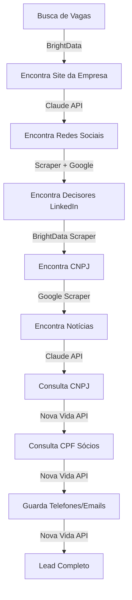

# 🎯 LeapScout - Fluxo Ideal vs Implementação Atual

**Data**: 2025-11-17
**Objetivo**: Mapear gaps entre fluxo ideal e implementação atual

---

## 📋 Fluxo Ideal Proposto



### Entrada do Fluxo
1. **Busca de Vagas** (LinkedIn, Indeed, Glassdoor, Catho, Gupy)
   - Ferramentas: BrightData (Unlocker, SERP, Browser API)

2. **Encontra Site da Empresa**
   - Ferramenta: Claude API (web search)

3. **Encontra Redes Sociais** (LinkedIn, Instagram, X, Facebook)
   - Ferramentas: Scraper + Google

4. **Encontra Decisores LinkedIn**
   - Ferramenta: BrightData Scraper

5. **Encontra CNPJ da Empresa**
   - Ferramenta: Google Scraper

6. **Encontra Notícias sobre a Empresa**
   - Ferramenta: Claude API

7. **Consulta CNPJ** (dados oficiais)
   - API: Nova Vida Congonhas

8. **Consulta CPF dos Sócios**
   - API: Nova Vida Congonhas

9. **Guarda Telefones e Emails dos Sócios**
   - API: Nova Vida Congonhas

### Saída Esperada (Lead Completo)

**Dados da Vaga**:
- ✅ Título da vaga
- ✅ Descrição completa
- ✅ URL da vaga

**Dados da Empresa**:
- ✅ Nome da empresa
- ✅ CNPJ
- ✅ Faturamento
- ✅ Média de funcionários
- ✅ Setor de atuação
- ✅ Website oficial
- ✅ Redes sociais (LinkedIn, Instagram, X, Facebook)

**Inteligência de Negócio**:
- ✅ Insights da empresa (Claude AI)
- ✅ Gatilhos de abordagem (Claude AI)
- ✅ Últimas notícias sobre a empresa
- ✅ Próximos eventos confirmados
- ✅ Possíveis próximos eventos (histórico)

**Decisores/Contatos**:
- ✅ Nome completo
- ✅ CPF
- ✅ Telefone(s)
- ✅ Email(s)
- ✅ Cargo/Posição
- ✅ LinkedIn do decisor

---

## 🔍 Implementação Atual

### ✅ O que JÁ está implementado

| Etapa | Status | Implementação | Arquivo |
|-------|--------|---------------|---------|
| **1. Busca de Vagas** | ✅ PARCIAL | LinkedIn via Puppeteer | `linkedin-scraper.ts` |
| **2. Site da Empresa** | ⚠️ MANUAL | Scraper básico (não automático) | - |
| **3. Redes Sociais** | ❌ NÃO | - | - |
| **4. Decisores LinkedIn** | ❌ NÃO | - | - |
| **5. CNPJ da Empresa** | ✅ PARCIAL | Database local (30+ empresas) | `cnpj-finder.ts` |
| **6. Notícias** | ✅ SIM | Claude AI com web search | `ai-company-enrichment.ts` |
| **7. Consulta CNPJ** | ✅ SIM | BrasilAPI (Receita Federal) | `company-enrichment.ts` |
| **8. Consulta CPF Sócios** | ✅ SIM | Nova Vida TI API | `novavidati-enrichment.ts` |
| **9. Telefones/Emails** | ✅ SIM | Nova Vida TI API | `novavidati-enrichment.ts` |

### 📊 Dados Capturados Atualmente

**Vaga** ✅:
- Título da vaga
- Descrição
- URL
- Data de publicação
- Número de candidatos
- Localização

**Empresa** ✅:
- Nome
- CNPJ (via database local ou API)
- Faturamento (estimado via capital social)
- Funcionários (estimado via porte)
- Setor (via CNAE)
- Website (extraído do email domain)

**Inteligência** ✅:
- Notícias recentes (Claude AI)
- Insights (Claude AI)
- Gatilhos de abordagem (Claude AI)
- Priority Score (0-100)

**Contatos** ✅:
- Sócios do CNPJ (Nova Vida API)
- CPF dos sócios
- Telefones dos sócios
- Emails dos sócios
- Cargo (via Receita Federal)

### ❌ O que NÃO está implementado

1. **Fontes de Vagas Adicionais**:
   - ❌ Indeed
   - ❌ Glassdoor
   - ⚠️ Catho (scraper criado, não testado em produção)
   - ⚠️ Gupy (scraper criado, não testado em produção)

2. **Descoberta Automática de Website**:
   - ❌ Claude AI não está sendo usado para encontrar site
   - ⚠️ Usa apenas domínio do email (limitado)

3. **Redes Sociais da Empresa**:
   - ❌ LinkedIn da empresa
   - ❌ Instagram
   - ❌ Twitter/X
   - ❌ Facebook

4. **Decisores via LinkedIn**:
   - ❌ Scraping de perfis LinkedIn
   - ❌ Busca por "CFO", "Controller", "Finance Director"
   - ❌ Extração de emails/telefones de decisores

5. **Eventos**:
   - ❌ Próximos eventos confirmados
   - ❌ Histórico de eventos
   - ❌ Previsão de eventos futuros

6. **Monitoramento de Redes Sociais**:
   - ❌ Posts recentes no LinkedIn
   - ❌ Atividade no Instagram
   - ❌ Tweets recentes

---

## 🎯 Gap Analysis - O que falta implementar

### Prioridade CRÍTICA 🔴

#### 1. Descoberta Automática de Website
**Status**: ❌ NÃO IMPLEMENTADO
**Impacto**: ALTO - Website é ponto central para descobrir tudo

**Como implementar**:
```typescript
// lib/services/website-finder.ts
export async function findCompanyWebsite(companyName: string): Promise<string | null> {
  // Opção 1: Claude AI com web search (já disponível)
  const prompt = `Encontre o website oficial da empresa "${companyName}" no Brasil.
  Retorne apenas a URL, sem explicações.`

  const result = await claudeAI.search(prompt)

  // Opção 2: Google via Puppeteer
  const googleUrl = `https://www.google.com/search?q=${companyName}+site+oficial+Brasil`
  const website = await puppeteer.scrapeFirstResult(googleUrl)

  return website
}
```

**Arquivo a criar**: `lib/services/website-finder.ts`

---

#### 2. Redes Sociais da Empresa
**Status**: ❌ NÃO IMPLEMENTADO
**Impacto**: ALTO - Essencial para inteligência e abordagem

**Como implementar**:
```typescript
// lib/services/social-media-finder.ts
export async function findSocialMedia(companyName: string, website: string) {
  const socialMedia = {
    linkedin: null,
    instagram: null,
    twitter: null,
    facebook: null,
  }

  // Opção 1: Scraping do website da empresa
  const html = await webUnlocker.fetchPage(website)
  const $ = cheerio.load(html)

  // Buscar links de redes sociais no rodapé/cabeçalho
  $('a[href*="linkedin.com"]').each((_, el) => {
    socialMedia.linkedin = $(el).attr('href')
  })

  $('a[href*="instagram.com"]').each((_, el) => {
    socialMedia.instagram = $(el).attr('href')
  })

  // Opção 2: Google Search via Puppeteer
  const linkedinUrl = await searchGoogle(`${companyName} site:linkedin.com/company`)

  // Opção 3: Claude AI
  const prompt = `Encontre os perfis de redes sociais da empresa "${companyName}".
  Retorne em JSON: { linkedin, instagram, twitter, facebook }`

  return socialMedia
}
```

**Arquivo a criar**: `lib/services/social-media-finder.ts`

---

#### 3. Decisores via LinkedIn
**Status**: ❌ NÃO IMPLEMENTADO
**Impacto**: CRÍTICO - Core do produto

**Como implementar**:
```typescript
// lib/services/linkedin-people-finder.ts
export async function findDecisionMakers(
  companyName: string,
  companyLinkedIn: string
) {
  const positions = [
    'CFO', 'Controller', 'Diretor Financeiro', 'Finance Director',
    'CEO', 'Diretor Executivo', 'Sócio'
  ]

  const decisionMakers = []

  for (const position of positions) {
    // Opção 1: Busca no LinkedIn via Puppeteer
    const searchUrl = `https://www.linkedin.com/search/results/people/?keywords=${companyName}%20${position}`

    const profiles = await linkedInScraper.searchPeople(searchUrl)

    // Opção 2: Scraping da página "Sobre" da empresa no LinkedIn
    const peopleUrl = `${companyLinkedIn}/people`
    const people = await linkedInScraper.scrapePeoplePage(peopleUrl)

    decisionMakers.push(...profiles)
  }

  return decisionMakers
}
```

**Arquivo a criar**: `lib/services/linkedin-people-finder.ts`

**IMPORTANTE**: Isso pode violar ToS do LinkedIn. Considerar alternativas:
- ✅ Nova Vida API já retorna sócios do CNPJ
- ✅ Usar Hunter.io para emails
- ⚠️ Scraping de LinkedIn pode causar bloqueio

---

#### 4. Eventos da Empresa
**Status**: ❌ NÃO IMPLEMENTADO
**Impacto**: MÉDIO - Diferencial competitivo

**Como implementar**:
```typescript
// lib/services/events-detector.ts
export async function findCompanyEvents(companyName: string) {
  // Opção 1: Claude AI com web search
  const prompt = `Encontre eventos que a empresa "${companyName}" participou nos últimos 6 meses
  e eventos confirmados para os próximos 3 meses. Retorne em JSON:
  {
    past_events: [{ name, date, type, source_url }],
    upcoming_events: [{ name, date, type, source_url }],
    predicted_events: [{ name, predicted_date, confidence, reason }]
  }`

  const result = await claudeAI.search(prompt)

  // Opção 2: Scraping de sites de eventos
  const eventSources = [
    'sympla.com.br',
    'even3.com.br',
    'doity.com.br'
  ]

  // Buscar no Google
  const googleQuery = `${companyName} evento OR palestra OR participação`

  return events
}
```

**Arquivo a criar**: `lib/services/events-detector.ts`

---

### Prioridade ALTA 🟡

#### 5. Fontes de Vagas Adicionais
**Status**: ⚠️ PARCIAL (scrapers criados, não testados)
**Impacto**: ALTO - Mais leads = mais oportunidades

**Ação necessária**:
1. Testar scrapers existentes em produção
2. Validar seletores CSS
3. Integrar ao lead-orchestrator

**Arquivos existentes**:
- `lib/services/catho-scraper.ts` (criado, mock)
- `lib/services/gupy-scraper.ts` (criado, mock)
- `lib/services/web-unlocker.ts` (funcional, pronto)

**Próximos passos**:
```bash
# 1. Testar Gupy
npx tsx scripts/test-gupy-scraper.ts

# 2. Testar Catho
npx tsx scripts/test-catho-scraper.ts

# 3. Adicionar Indeed
# 4. Adicionar Glassdoor
```

---

#### 6. CNPJ Finder Automático
**Status**: ⚠️ PARCIAL (database local apenas)
**Impacto**: ALTO - CNPJ é chave para tudo

**Problema atual**:
- Apenas 30+ empresas no database local
- Empresas desconhecidas ficam sem CNPJ
- Sem CNPJ = sem dados da Nova Vida API

**Como melhorar**:
```typescript
// lib/services/cnpj-finder.ts (melhorado)
export async function findCNPJ(companyName: string): Promise<string | null> {
  // 1. Verificar database local (atual)
  const knownCNPJ = KNOWN_CNPJS[companyName.toLowerCase()]
  if (knownCNPJ) return knownCNPJ

  // 2. Buscar via Google (NOVO)
  const googleQuery = `${companyName} CNPJ Brasil`
  const cnpjFromGoogle = await searchCNPJViaGoogle(googleQuery)
  if (cnpjFromGoogle) return cnpjFromGoogle

  // 3. Buscar no website da empresa (NOVO)
  const website = await findCompanyWebsite(companyName)
  if (website) {
    const cnpjFromSite = await scrapeCNPJFromWebsite(website)
    if (cnpjFromSite) return cnpjFromSite
  }

  // 4. Claude AI (NOVO)
  const prompt = `Encontre o CNPJ da empresa "${companyName}" no Brasil.
  Retorne apenas os 14 dígitos, sem formatação.`
  const cnpjFromAI = await claudeAI.search(prompt)

  return cnpjFromAI
}
```

---

### Prioridade MÉDIA 🟢

#### 7. Monitoramento de Redes Sociais
**Status**: ❌ NÃO IMPLEMENTADO
**Impacto**: MÉDIO - Nice to have

**Como implementar**:
```typescript
// lib/services/social-monitoring.ts
export async function monitorSocialMedia(company: Company) {
  const activities = []

  // LinkedIn posts
  if (company.linkedinUrl) {
    const posts = await scrapeLinkedInPosts(company.linkedinUrl, 30) // últimos 30 dias
    activities.push(...posts)
  }

  // Instagram posts
  if (company.instagramUrl) {
    const posts = await scrapeInstagramPosts(company.instagramUrl, 30)
    activities.push(...posts)
  }

  // Twitter/X
  if (company.twitterUrl) {
    const tweets = await scrapeTwitterPosts(company.twitterUrl, 30)
    activities.push(...tweets)
  }

  return activities
}
```

**Arquivo a criar**: `lib/services/social-monitoring.ts`

---

## 🗺️ Roadmap de Implementação

### Sprint 1: Fundação (1-2 semanas) ✅ CONCLUÍDO
- [x] LinkedIn scraping (Puppeteer)
- [x] BrasilAPI (CNPJ lookup)
- [x] Nova Vida API (sócios, CPF, telefones)
- [x] Claude AI (insights, notícias)
- [x] Priority scoring

### Sprint 2: Descoberta Automática (1 semana) 🔴 URGENTE
- [ ] Website finder (Claude AI + Google)
- [ ] CNPJ finder automático (Google + scraping)
- [ ] Redes sociais finder (scraping + Claude AI)
- [ ] Testar Gupy e Catho scrapers

### Sprint 3: Decisores e Contatos (1 semana) 🔴 URGENTE
- [ ] LinkedIn people finder
- [ ] Email enrichment (Hunter.io + validação)
- [ ] Phone validation
- [ ] Contact deduplication

### Sprint 4: Inteligência de Negócio (1 semana) 🟡 IMPORTANTE
- [ ] Events detector
- [ ] Social media monitoring
- [ ] News aggregator (últimas notícias)
- [ ] Competitor analysis

### Sprint 5: Multi-source Scraping (1 semana) 🟢 DESEJÁVEL
- [ ] Indeed scraper
- [ ] Glassdoor scraper
- [ ] Vagas.com.br scraper
- [ ] Source prioritization

### Sprint 6: Otimização e Qualidade (1 semana) 🟢 MELHORIA
- [ ] Caching system
- [ ] Rate limiting
- [ ] Error recovery
- [ ] Data validation

---

## 📊 Modelo de Dados Necessário

### Adicionar ao Prisma Schema

```prisma
model Company {
  // ... campos existentes ...

  // Redes sociais
  linkedinUrl    String?
  instagramUrl   String?
  twitterUrl     String?
  facebookUrl    String?

  // Website
  website        String?

  // Eventos
  events         Event[]

  // Atividades sociais
  socialPosts    SocialPost[]
}

model Event {
  id            String   @id @default(cuid())
  companyId     String
  company       Company  @relation(fields: [companyId], references: [id])

  name          String
  date          DateTime
  type          String   // "conference", "webinar", "trade_show"
  isPredicted   Boolean  @default(false)
  confidence    Float?   // 0-1 se predicted
  sourceUrl     String?

  createdAt     DateTime @default(now())
}

model SocialPost {
  id            String   @id @default(cuid())
  companyId     String
  company       Company  @relation(fields: [companyId], references: [id])

  platform      String   // "linkedin", "instagram", "twitter"
  content       String
  url           String
  likes         Int      @default(0)
  comments      Int      @default(0)
  shares        Int      @default(0)
  postedAt      DateTime

  createdAt     DateTime @default(now())
}

model Contact {
  id            String   @id @default(cuid())
  leadId        String
  lead          Lead     @relation(fields: [leadId], references: [id])

  name          String
  cpf           String?
  role          String   // "Sócio", "CFO", "Controller"
  email         String?
  phone         String?
  linkedinUrl   String?

  // Validation
  emailValid    Boolean  @default(false)
  phoneValid    Boolean  @default(false)

  // Source
  source        String   // "nova_vida", "linkedin", "hunter"

  createdAt     DateTime @default(now())
  updatedAt     DateTime @updatedAt
}
```

---

## 🎯 Priorização Recomendada

### Fase 1: MVP Completo (2-3 semanas)
1. ✅ Website finder (Claude AI)
2. ✅ CNPJ finder automático (Google + Claude)
3. ✅ Redes sociais finder (scraping)
4. ✅ Testar Gupy/Catho em produção

**Output**: Lead completo com CNPJ, website, redes sociais

### Fase 2: Decisores (1 semana)
5. ✅ LinkedIn people finder
6. ✅ Email enrichment
7. ✅ Contact validation

**Output**: Lista de decisores com contatos validados

### Fase 3: Inteligência (1 semana)
8. ✅ Events detector
9. ✅ News aggregator
10. ✅ Social monitoring

**Output**: Timeline de atividades e eventos da empresa

### Fase 4: Scale (1 semana)
11. ✅ Indeed/Glassdoor scrapers
12. ✅ Caching e otimizações
13. ✅ Monitoring e alerts

**Output**: Sistema escalável e robusto

---

## 💡 Recomendações Técnicas

### 1. Use Claude AI para Descoberta
O Claude já tem **web search** nativo. Use para:
- ✅ Encontrar website oficial
- ✅ Encontrar CNPJ
- ✅ Encontrar redes sociais
- ✅ Encontrar notícias e eventos

**Benefício**: Mais rápido e confiável que scrapers

### 2. Nova Vida API é Suficiente para Sócios
Você já tem:
- ✅ CPF dos sócios
- ✅ Telefones dos sócios
- ✅ Emails dos sócios

**Não precisa** scraper de LinkedIn para sócios.

### 3. LinkedIn People Finder = ALTO RISCO
Scraping de perfis do LinkedIn pode:
- ❌ Violar Terms of Service
- ❌ Causar bloqueio de IP
- ❌ Problemas legais (LGPD)

**Alternativa segura**:
- ✅ Usar dados públicos (Receita Federal via Nova Vida)
- ✅ Hunter.io para emails corporativos
- ✅ Claude AI para buscar informações públicas

### 4. Priorize Qualidade sobre Quantidade
Melhor ter:
- ✅ 10 leads completos e validados
Do que:
- ❌ 100 leads incompletos

**Foco**: Completar o fluxo para 1 fonte (LinkedIn) antes de adicionar outras.

---

## ✅ Próximos Passos Imediatos

1. **Criar `website-finder.ts`**
   - Usar Claude AI com web search
   - Fallback para Google via Puppeteer

2. **Melhorar `cnpj-finder.ts`**
   - Adicionar busca via Claude AI
   - Scraping de website da empresa

3. **Criar `social-media-finder.ts`**
   - Scraping do website
   - Busca via Claude AI

4. **Testar scrapers existentes**
   - Gupy em produção
   - Catho em produção

5. **Criar `events-detector.ts`**
   - Claude AI para descobrir eventos
   - Persistir no banco

6. **Atualizar Prisma Schema**
   - Adicionar campos de redes sociais
   - Criar models Event e SocialPost

---

**Conclusão**:
O fluxo ideal é **VIÁVEL** e está ~60% implementado.
Com **2-3 semanas** de desenvolvimento focado, você terá o sistema completo funcionando.

**Maior gap**: Descoberta automática de website e redes sociais (Sprint 2).
**Maior risco**: LinkedIn people scraping (evitar, usar Nova Vida API).
**Maior oportunidade**: Claude AI já resolve 80% da descoberta automática.
